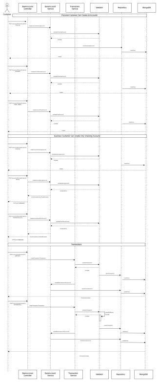

# Bank Account Microservice

## Description
This microservice is part of a digital banking architecture responsible for managing bank accounts and their transactions. Implemented with Spring WebFlux to provide a reactive API, it offers complete functionality for account management and financial transaction recording.

## Microservice flowchart

